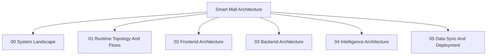

# Architecture Diagram Map

- [00-system-landscape.md](./architecture/00-system-landscape.md)
- [01-runtime-topology-and-flows.md](./architecture/01-runtime-topology-and-flows.md)
- [02-frontend-architecture.md](./architecture/02-frontend-architecture.md)
- [03-backend-architecture.md](./architecture/03-backend-architecture.md)
- [04-intelligence-architecture.md](./architecture/04-intelligence-architecture.md)
- [05-data-sync-and-deployment.md](./architecture/05-data-sync-and-deployment.md)
