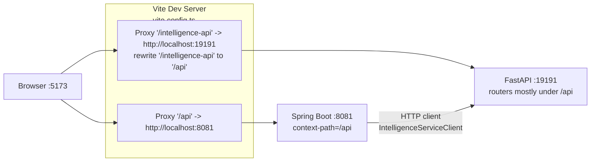
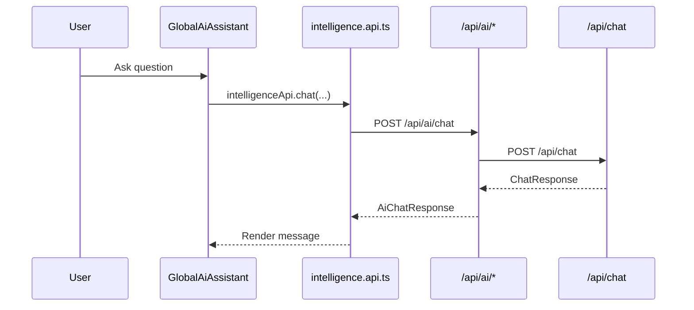
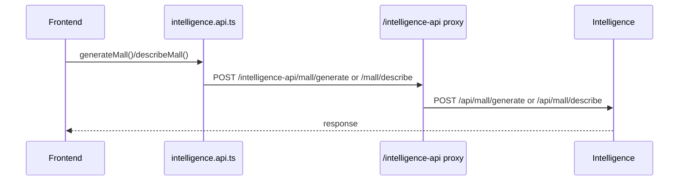

# Runtime Topology And Request Paths

```mermaid
flowchart LR
    Browser["Browser :5173"]

    subgraph VITE["Vite Dev Server\nvite.config.ts"]
      ProxyAPI["Proxy '/api' -> http://localhost:8081"]
      ProxyIA["Proxy '/intelligence-api' -> http://localhost:19191\nrewrite '/intelligence-api' to '/api'"]
    end

    BE["Spring Boot :8081\ncontext-path=/api"]
    IA["FastAPI :19191\nrouters mostly under /api"]

    Browser --> ProxyAPI --> BE
    Browser --> ProxyIA --> IA

    BE -->|"HTTP client\nIntelligenceServiceClient"| IA
```

```mermaid
sequenceDiagram
    participant U as User
    participant FE as GlobalAiAssistant
    participant API as intelligence.api.ts
    participant JAVA as /api/ai/*
    participant PY as /api/chat

    U->>FE: Ask question
    FE->>API: intelligenceApi.chat(...)
    API->>JAVA: POST /api/ai/chat
    JAVA->>PY: POST /api/chat
    PY-->>JAVA: ChatResponse
    JAVA-->>API: AiChatResponse
    API-->>FE: Render message
```

```mermaid
sequenceDiagram
    participant FE as Frontend
    participant API as intelligence.api.ts
    participant VITE as /intelligence-api proxy
    participant PY as Intelligence

    FE->>API: generateMall()/describeMall()
    API->>VITE: POST /intelligence-api/mall/generate or /mall/describe
    VITE->>PY: POST /api/mall/generate or /api/mall/describe
    PY-->>FE: response
```
