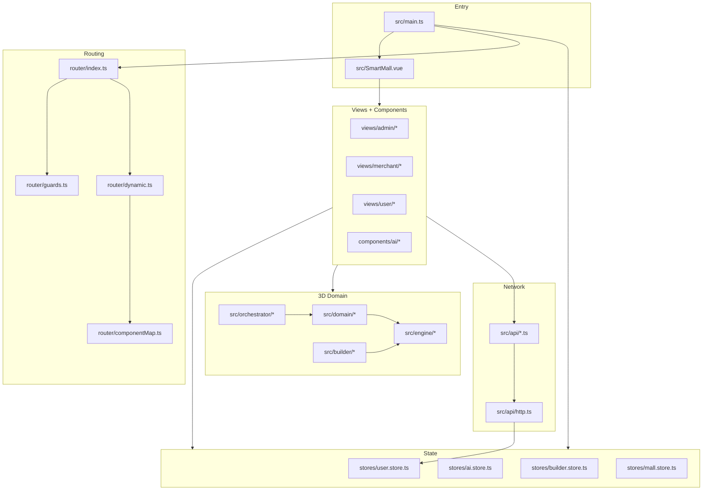
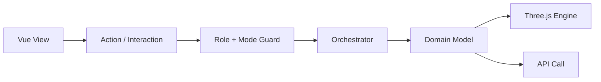

# Frontend Architecture

```mermaid
graph TB
    subgraph ENTRY["Entry"]
      MAIN["src/main.ts"]
      ROOT["src/SmartMall.vue"]
    end

    subgraph ROUTING["Routing"]
      RINDEX["router/index.ts"]
      RGUARD["router/guards.ts"]
      RDYN["router/dynamic.ts"]
      RMAP["router/componentMap.ts"]
    end

    subgraph STATE["State"]
      USTORE["stores/user.store.ts"]
      ASTORE["stores/ai.store.ts"]
      BSTORE["stores/builder.store.ts"]
      MSTORE["stores/mall.store.ts"]
    end

    subgraph UI["Views + Components"]
      VADMIN["views/admin/*"]
      VMER["views/merchant/*"]
      VUSER["views/user/*"]
      CAI["components/ai/*"]
    end

    subgraph DOMAIN["3D Domain"]
      BUILDER["src/builder/*"]
      ENGINE["src/engine/*"]
      DOMAINM["src/domain/*"]
      ORCH["src/orchestrator/*"]
    end

    subgraph NET["Network"]
      API["src/api/*.ts"]
      HTTP["src/api/http.ts"]
    end

    MAIN --> ROOT
    MAIN --> RINDEX
    MAIN --> STATE
    RINDEX --> RGUARD
    RINDEX --> RDYN
    RDYN --> RMAP

    ROOT --> UI
    UI --> STATE
    UI --> DOMAIN
    UI --> API

    API --> HTTP
    HTTP --> USTORE

    ORCH --> DOMAINM
    DOMAINM --> ENGINE
    BUILDER --> ENGINE
```

```mermaid
flowchart LR
    View["Vue View"] --> Action["Action / Interaction"]
    Action --> Guard["Role + Mode Guard"]
    Guard --> Orchestrator["Orchestrator"]
    Orchestrator --> Domain["Domain Model"]
    Domain --> Engine["Three.js Engine"]
    Domain --> ApiCall["API Call"]
```
