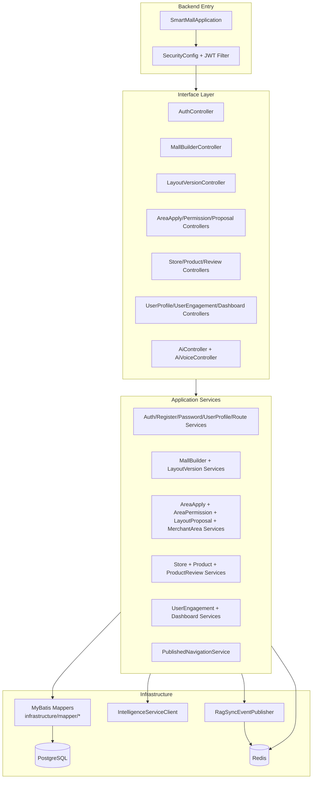
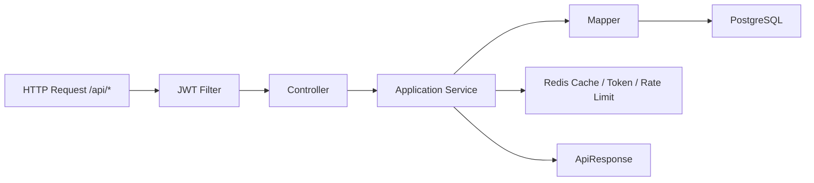

# Backend Architecture

```mermaid
graph TB
    subgraph ENTRY["Backend Entry"]
      APP["SmartMallApplication"]
      SEC["SecurityConfig + JWT Filter"]
    end

    subgraph IFACE["Interface Layer"]
      C_AUTH["AuthController"]
      C_BUILDER["MallBuilderController"]
      C_LAYOUT["LayoutVersionController"]
      C_AREA["AreaApply/Permission/Proposal Controllers"]
      C_STORE["Store/Product/Review Controllers"]
      C_USER["UserProfile/UserEngagement/Dashboard Controllers"]
      C_AI["AiController + AiVoiceController"]
    end

    subgraph APP_SVC["Application Services"]
      S_AUTH["Auth/Register/Password/UserProfile/Route Services"]
      S_MALL["MallBuilder + LayoutVersion Services"]
      S_AREA["AreaApply + AreaPermission + LayoutProposal + MerchantArea Services"]
      S_STORE["Store + Product + ProductReview Services"]
      S_USER["UserEngagement + Dashboard Services"]
      S_NAV["PublishedNavigationService"]
    end

    subgraph INFRA["Infrastructure"]
      MAPPER["MyBatis Mappers\ninfrastructure/mapper/*"]
      EXT_IA["IntelligenceServiceClient"]
      EXT_RAG["RagSyncEventPublisher"]
      DB[(PostgreSQL)]
      REDIS[(Redis)]
    end

    APP --> SEC
    SEC --> IFACE

    IFACE --> APP_SVC
    APP_SVC --> MAPPER
    APP_SVC --> EXT_IA
    APP_SVC --> EXT_RAG

    MAPPER --> DB
    APP_SVC --> REDIS
    EXT_RAG --> REDIS
```

```mermaid
flowchart LR
    Req["HTTP Request /api/*"] --> Jwt["JWT Filter"]
    Jwt --> Ctrl["Controller"]
    Ctrl --> Service["Application Service"]
    Service --> Mapper["Mapper"]
    Mapper --> PG["PostgreSQL"]
    Service --> Cache["Redis Cache / Token / Rate Limit"]
    Service --> Resp["ApiResponse"]
```
