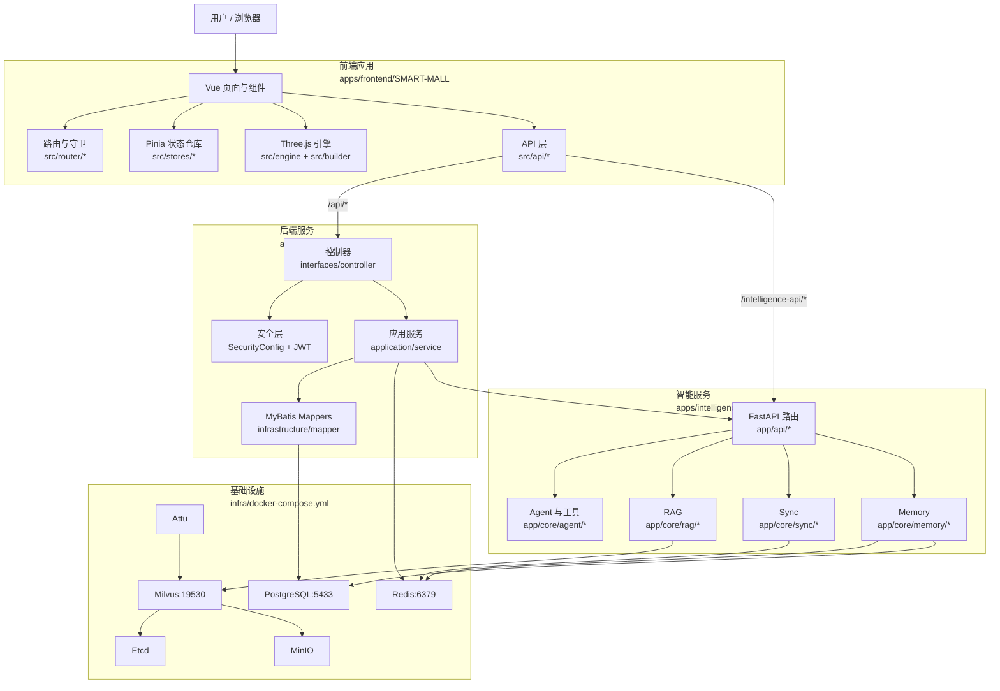

# 系统全景

```mermaid
graph TB
    User["用户 / 浏览器"]

    subgraph FE["前端应用\napps/frontend/SMART-MALL"]
      FE_UI["Vue 页面与组件"]
      FE_API["API 层\nsrc/api/*"]
      FE_ROUTER["路由与守卫\nsrc/router/*"]
      FE_STORE["Pinia 状态仓库\nsrc/stores/*"]
      FE_3D["Three.js 引擎\nsrc/engine + src/builder"]
    end

    subgraph BE["后端服务\napps/backend/SMART-MALL"]
      BE_CTRL["控制器\ninterfaces/controller"]
      BE_SVC["应用服务\napplication/service"]
      BE_SEC["安全层\nSecurityConfig + JWT"]
      BE_MAP["MyBatis Mappers\ninfrastructure/mapper"]
    end

    subgraph IA["智能服务\napps/intelligence/SMART-MALL"]
      IA_API["FastAPI 路由\napp/api/*"]
      IA_AGENT["Agent 与工具\napp/core/agent/*"]
      IA_RAG["RAG\napp/core/rag/*"]
      IA_SYNC["Sync\napp/core/sync/*"]
      IA_MEM["Memory\napp/core/memory/*"]
    end

    subgraph INFRA["基础设施\ninfra/docker-compose.yml"]
      PG["PostgreSQL:5433"]
      REDIS["Redis:6379"]
      MILVUS["Milvus:19530"]
      ETCD["Etcd"]
      MINIO["MinIO"]
      ATTU["Attu"]
    end

    User --> FE_UI
    FE_UI --> FE_ROUTER
    FE_UI --> FE_STORE
    FE_UI --> FE_3D
    FE_UI --> FE_API

    FE_API -->|"/api/*"| BE_CTRL
    FE_API -->|"/intelligence-api/*"| IA_API

    BE_CTRL --> BE_SEC
    BE_CTRL --> BE_SVC
    BE_SVC --> BE_MAP
    BE_MAP --> PG
    BE_SVC --> REDIS
    BE_SVC --> IA_API

    IA_API --> IA_AGENT
    IA_API --> IA_RAG
    IA_API --> IA_SYNC
    IA_API --> IA_MEM
    IA_RAG --> MILVUS
    IA_SYNC --> REDIS
    IA_MEM --> REDIS
    IA_MEM --> PG

    MILVUS --> ETCD
    MILVUS --> MINIO
    ATTU --> MILVUS
```
