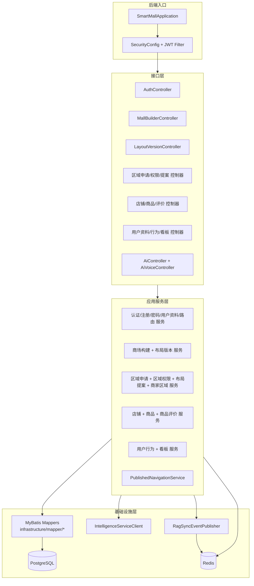
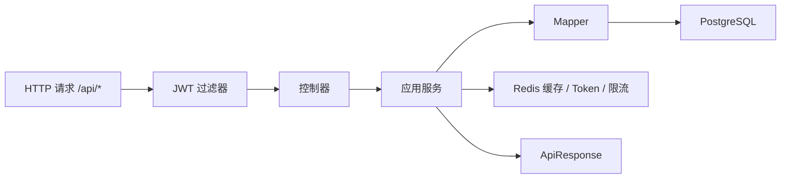

# 后端架构

```mermaid
graph TB
    subgraph ENTRY["后端入口"]
      APP["SmartMallApplication"]
      SEC["SecurityConfig + JWT Filter"]
    end

    subgraph IFACE["接口层"]
      C_AUTH["AuthController"]
      C_BUILDER["MallBuilderController"]
      C_LAYOUT["LayoutVersionController"]
      C_AREA["区域申请/权限/提案 控制器"]
      C_STORE["店铺/商品/评价 控制器"]
      C_USER["用户资料/行为/看板 控制器"]
      C_AI["AiController + AiVoiceController"]
    end

    subgraph APP_SVC["应用服务层"]
      S_AUTH["认证/注册/密码/用户资料/路由 服务"]
      S_MALL["商场构建 + 布局版本 服务"]
      S_AREA["区域申请 + 区域权限 + 布局提案 + 商家区域 服务"]
      S_STORE["店铺 + 商品 + 商品评价 服务"]
      S_USER["用户行为 + 看板 服务"]
      S_NAV["PublishedNavigationService"]
    end

    subgraph INFRA["基础设施层"]
      MAPPER["MyBatis Mappers\ninfrastructure/mapper/*"]
      EXT_IA["IntelligenceServiceClient"]
      EXT_RAG["RagSyncEventPublisher"]
      DB[(PostgreSQL)]
      REDIS[(Redis)]
    end

    APP --> SEC
    SEC --> IFACE

    IFACE --> APP_SVC
    APP_SVC --> MAPPER
    APP_SVC --> EXT_IA
    APP_SVC --> EXT_RAG

    MAPPER --> DB
    APP_SVC --> REDIS
    EXT_RAG --> REDIS
```

```mermaid
flowchart LR
    Req["HTTP 请求 /api/*"] --> Jwt["JWT 过滤器"]
    Jwt --> Ctrl["控制器"]
    Ctrl --> Service["应用服务"]
    Service --> Mapper["Mapper"]
    Mapper --> PG["PostgreSQL"]
    Service --> Cache["Redis 缓存 / Token / 限流"]
    Service --> Resp["ApiResponse"]
```
