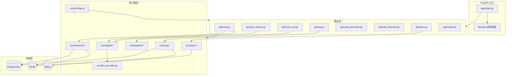
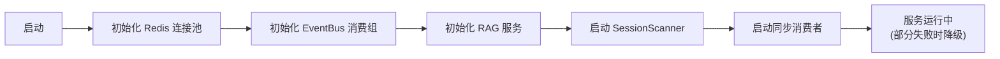

# 智能服务架构

```mermaid
graph TB
    subgraph ENTRY["FastAPI 入口"]
      MAIN["app/main.py"]
      LIFE["lifespan 启停流程"]
    end

    subgraph API["路由层"]
      CHAT["api/chat.py"]
      STREAM["api/chat_stream.py"]
      VOICE["api/voice_ws.py"]
      RAG_API["api/rag.py"]
      MG["api/mall_generator.py"]
      MD["api/mall_describe.py"]
      SYNC_API["api/sync.py"]
      HEALTH["api/health.py"]
    end

    subgraph CORE["核心模块"]
      AGENT["core/agent/*"]
      RAG["core/rag/*"]
      MEM["core/memory/*"]
      SYNC["core/sync/*"]
      SPEECH["core/speech/*"]
      LLM["core/llm_provider.py"]
      CFG["core/config.py"]
    end

    subgraph STORAGE["存储层"]
      PG[(PostgreSQL)]
      REDIS[(Redis)]
      MILVUS[(Milvus)]
    end

    MAIN --> LIFE
    MAIN --> API
    API --> CORE

    CHAT --> AGENT
    CHAT --> MEM
    STREAM --> AGENT
    VOICE --> SPEECH
    RAG_API --> RAG
    SYNC_API --> SYNC

    AGENT --> LLM
    RAG --> MILVUS
    RAG --> PG
    MEM --> REDIS
    MEM --> PG
    SYNC --> REDIS

    CFG --> API
    CFG --> CORE
```

```mermaid
flowchart LR
    Start["启动"] --> InitRedis["初始化 Redis 连接池"]
    InitRedis --> InitBus["初始化 EventBus 消费组"]
    InitBus --> InitRag["初始化 RAG 服务"]
    InitRag --> StartScanner["启动 SessionScanner"]
    StartScanner --> StartConsumer["启动同步消费者"]
    StartConsumer --> Running["服务运行中\n(部分失败时降级)"]
```
