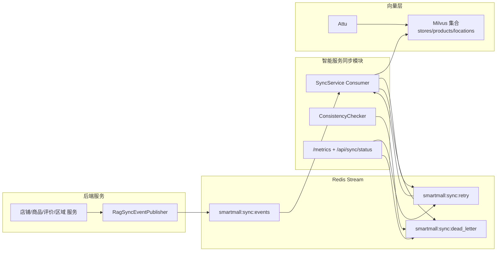
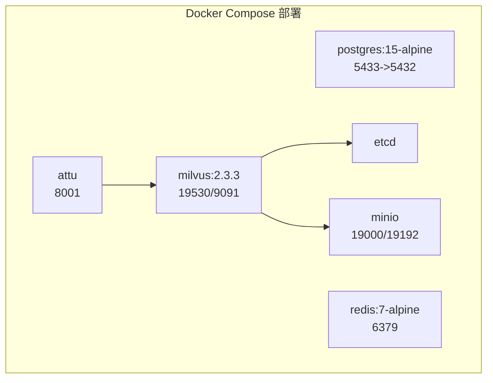
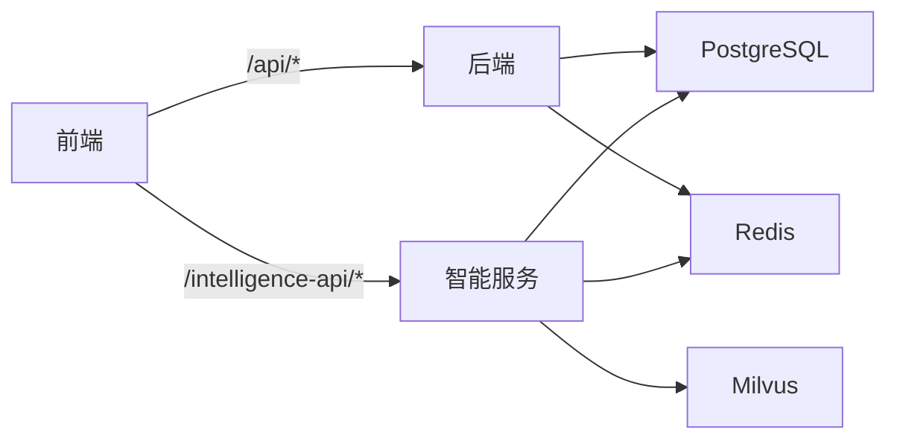

# 数据同步与部署架构

```mermaid
graph LR
    subgraph JAVA["后端服务"]
      BIZ["店铺/商品/评价/区域 服务"]
      PUB["RagSyncEventPublisher"]
    end

    subgraph REDIS["Redis Stream"]
      STREAM["smartmall:sync:events"]
      RETRY["smartmall:sync:retry"]
      DLQ["smartmall:sync:dead_letter"]
    end

    subgraph PY["智能服务同步模块"]
      CONSUMER["SyncService Consumer"]
      CHECKER["ConsistencyChecker"]
      METRICS["/metrics + /api/sync/status"]
    end

    subgraph VECTOR["向量层"]
      MILVUS["Milvus 集合\nstores/products/locations"]
      ATTU["Attu"]
    end

    BIZ --> PUB --> STREAM
    STREAM --> CONSUMER
    CONSUMER --> MILVUS
    CONSUMER --> RETRY
    RETRY --> CONSUMER
    CONSUMER --> DLQ
    CHECKER --> DLQ
    METRICS --> RETRY
    METRICS --> DLQ
    ATTU --> MILVUS
```

```mermaid
graph TB
    subgraph DEPLOY["Docker Compose 部署"]
      PG["postgres:15-alpine\n5433->5432"]
      REDIS["redis:7-alpine\n6379"]
      ETCD["etcd"]
      MINIO["minio\n19000/19192"]
      MILVUS["milvus:2.3.3\n19530/9091"]
      ATTU["attu\n8001"]
    end

    MILVUS --> ETCD
    MILVUS --> MINIO
    ATTU --> MILVUS
```

```mermaid
flowchart LR
    FE["前端"] -->|"/api/*"| BE["后端"]
    FE -->|"/intelligence-api/*"| IA["智能服务"]
    BE --> PG["PostgreSQL"]
    BE --> R["Redis"]
    IA --> PG
    IA --> R
    IA --> M["Milvus"]
```
