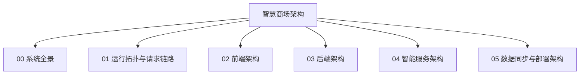

# 架构图导航

- [00-system-landscape.md](./00-system-landscape.md)
- [01-runtime-topology-and-flows.md](./01-runtime-topology-and-flows.md)
- [02-frontend-architecture.md](./02-frontend-architecture.md)
- [03-backend-architecture.md](./03-backend-architecture.md)
- [04-intelligence-architecture.md](./04-intelligence-architecture.md)
- [05-data-sync-and-deployment.md](./05-data-sync-and-deployment.md)
